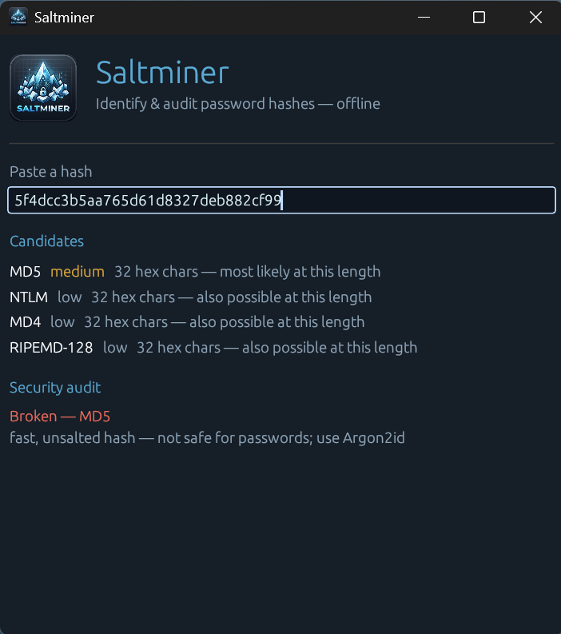
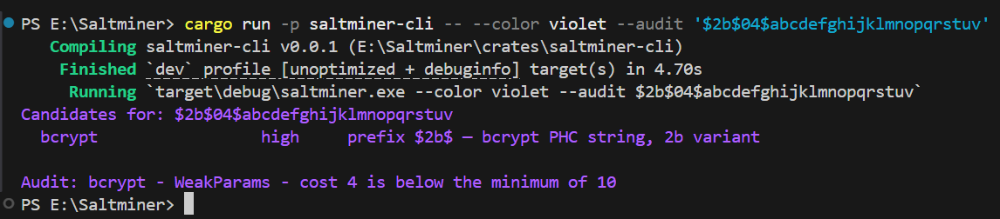
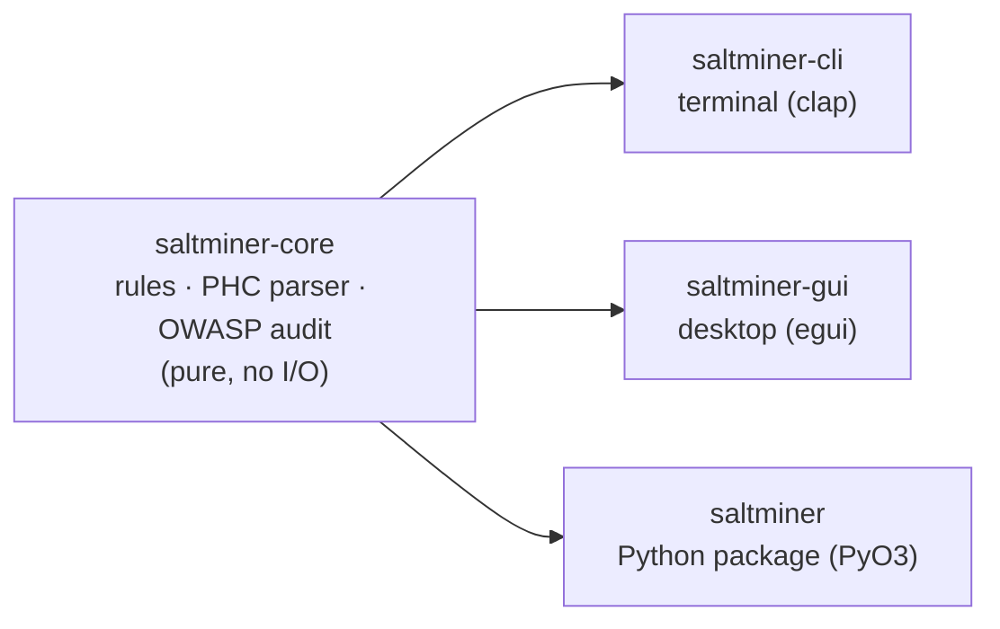

<div align="center">


# Saltminer

**Identify and audit password hashes — offline, in one tool.**

[](https://github.com/DebanganMALI/Salt-miner/actions/workflows/ci.yml)
[](https://pypi.org/project/saltminer/)
[](https://pypi.org/project/saltminer/)
[](LICENSE)

</div>

---

## What is Saltminer?

Hand someone a string like `5f4dcc3b5aa765d61d8327deb882cf99` or
`$argon2id$v=19$m=65536,t=3,p=4$...` and the first question is always the same:
**what produced this, and is it still safe?**

Saltminer answers both. It takes a hash string and tells you:

1. **What it is** — ranked algorithm candidates, each with a confidence level and a
   plain-English reason.
2. **Whether it's safe** — a security verdict against current
   [OWASP Password Storage](https://cheatsheetseries.owasp.org/cheatsheets/Password_Storage_Cheat_Sheet.html)
   guidance: is the algorithm modern, and are its cost parameters strong enough?

It runs **fully offline** — no network, no files, no telemetry. A single Rust engine
powers three interfaces: a **command-line tool**, a **desktop GUI**, and a
**Python library**.

---

## Features

- **Identify ~30 hash formats** by prefix, length, and character set — bcrypt,
  the Argon2 family, the Unix crypt family, MySQL5, NetNTLMv1/v2, pwdump/NTLM,
  and bare hex digests (MD5, SHA-1, SHA-256, SHA-512, and more).
- **Security auditing** — parses PHC cost parameters and judges them against OWASP
  thresholds: `secure`, `weak-params`, `deprecated`, or `broken`, each with a reason.
- **Recognises non-hashes** — tells you when you've pasted a JWT or a base64 blob
  instead of leaving you guessing.
- **Three interfaces, one engine** — CLI, GUI, and a pip-installable Python package,
  all sharing the exact same identification logic.
- **Offline and dependency-light** — pure logic, no network or filesystem access.
- **Tested hard** — unit tests, property-based tests (`proptest`), and
  coverage-guided fuzzing (`cargo-fuzz`) running in CI.

---

## Screenshots

<div align="center">

**Desktop GUI**



**Command line**



</div>

---

## Install

### Python library (the quickest way to try it)

```bash
pip install saltminer
```

```python
import saltminer

saltminer.identify("5f4dcc3b5aa765d61d8327deb882cf99")
# [('MD5', 'medium', '32 hex chars — most likely at this length'),
#  ('NTLM', 'low', '32 hex chars — also possible at this length'), ...]

saltminer.audit("$2b$04$abcdefghijklmnopqrstuv")
# ('bcrypt', 'WeakParams', 'cost 4 is below the minimum of 10')
```

Wheels are published for Windows and Linux (Python 3.10+).

### CLI and GUI binaries

Download the prebuilt binaries for your platform from the
[latest release](https://github.com/DebanganMALI/Salt-miner/releases/latest),
or build them from source (see below).

---

## Usage

### CLI

```bash
saltminer <hash> [--color <colour>] [--audit]
```

| Flag | Description |
|------|-------------|
| `--audit`, `-a` | Also print the OWASP security verdict. |
| `--color`, `-c` | Output colour: `red`, `orange`, `yellow`, `green`, `blue`, `indigo`, `violet`. |

Examples:

```bash
saltminer 5f4dcc3b5aa765d61d8327deb882cf99
saltminer --audit '$2b$04$abcdefghijklmnopqrstuv'
saltminer --color violet --audit '$argon2id$v=19$m=1024,t=1,p=1$c2FsdA$aGFzaA'
```

> **Note:** always wrap a hash that starts with `$` in single quotes, or your shell
> will try to expand `$2`, `$1`, etc. as variables and mangle the input.

Exit codes: `0` when at least one candidate is found, `1` when nothing matches
(useful in scripts).

### GUI

Launch the `saltminer-gui` binary. Paste a hash into the field and the candidates
and audit verdict appear live, colour-coded by severity.

### Python

```python
import saltminer

candidates = saltminer.identify("$2b$12$EixZaYVK1fsbw1ZfbX3OXePaWxn96p36WQNQ")
report = saltminer.audit("$2b$12$EixZaYVK1fsbw1ZfbX3OXePaWxn96p36WQNQ")
```

`identify()` returns a list of `(algorithm, confidence, reason)` tuples;
`audit()` returns an `(algorithm, verdict, detail)` tuple, or `None` for formats
it does not rate.

---

## How it works

### Identification pipeline

`identify()` runs a fixed sequence of checks and returns the first that matches,
so the strongest signal always wins:

1. **Prefix rules** — a self-describing marker like `$2b$` (bcrypt) or `$argon2id$`
   is definitive → **high** confidence.
2. **Special shapes** — formats with an unmistakable structure but no prefix:
   MySQL5 (`*` + 40 uppercase hex), NetNTLMv1/v2, and pwdump/NTLM
   (`user:rid:lm:nt:::`).
3. **Length + charset** — a bare hex string is matched by its length (32 → MD5,
   40 → SHA-1, 64 → SHA-256, …), ranked by real-world prevalence: the most likely
   candidate gets **medium** confidence, the rest **low**.
4. **Not-a-hash hints** — a leading `eyJ` (a JWT) or base64-only characters
   (`+`, `/`, `=`) are flagged so you know what you actually pasted.

### Security auditor

For hashes with cost parameters, `audit()` parses them and compares against
OWASP guidance:

| Algorithm | Requirement for a `secure` verdict |
|-----------|------------------------------------|
| Argon2id | memory ≥ **19 MiB** |
| bcrypt | cost factor ≥ **10** |
| PBKDF2-HMAC-SHA256 | ≥ **600,000** iterations |
| MD5-crypt (`$1$`), Apache `$apr1$` | always **deprecated** |
| raw MD5 / SHA-1 / NTLM | always **broken** (fast, unsalted) |

---

## Architecture

Everything hard lives in one pure, I/O-free Rust library. The CLI, GUI, and Python
module are thin shells over it — a rule written once is correct in all three.



### Project layout

```
Saltminer/
├─ crates/
│  ├─ saltminer-core/   # the engine: identify() + audit(), and all tests
│  ├─ saltminer-cli/    # command-line interface (clap)
│  ├─ saltminer-gui/    # desktop app (eframe / egui)
│  └─ saltminer-py/     # Python bindings (PyO3), published to PyPI
├─ fuzz/                # cargo-fuzz target for the parser
├─ .github/workflows/   # CI + release automation
└─ docs/                # banner and screenshots
```

---

## Requirements

**To use the Python package:** Python **3.10 or newer** — that's it (`pip install saltminer`).

**To build from source:**

- **Rust 1.98+** (stable) — install from [rustup.rs](https://rustup.rs).
- **just** and **cargo-nextest** (optional, for the dev shortcuts): `cargo install just cargo-nextest`.
- **Building the GUI on Linux** additionally needs the X11/Wayland development libraries:
  ```bash
  sudo apt install libxcb-render0-dev libxcb-shape0-dev libxcb-xfixes0-dev \
    libxkbcommon-dev libwayland-dev
  ```
- **Building the Python wheel** needs [uv](https://astral.sh/uv) and
  [maturin](https://www.maturin.rs) (`uv tool install maturin`).

---

## Build from source

```bash
git clone https://github.com/DebanganMALI/Salt-miner.git
cd Salt-miner

# core + CLI
cargo build --release
cargo run -p saltminer-cli -- 5f4dcc3b5aa765d61d8327deb882cf99

# desktop GUI
cargo run --manifest-path crates/saltminer-gui/Cargo.toml

# Python module into a local environment
cd crates/saltminer-py
uv venv --python 3.13
uv pip install maturin
uv run maturin develop
```

With `just` installed you can use the shortcuts instead: `just test`, `just lint`,
`just build`, `just run <hash>`, `just gui`.

---

## Testing & quality

- **Unit + property tests:** `just test` (or `cargo nextest run`). Property tests use
  `proptest` to throw thousands of random inputs at the engine and prove it never panics.
- **Lint:** `just lint` runs `clippy` with warnings denied, plus a formatting check.
- **Fuzzing:** a `cargo-fuzz` target runs against the PHC parser in CI (Linux).
- **CI:** every push runs format, clippy, tests, and a fuzz smoke-run;
  tagged releases build and publish the wheels and binaries automatically.

---

## Credits

Inspired by [CarterPerez-dev/Cybersecurity-Projects](https://github.com/CarterPerez-dev/Cybersecurity-Projects)'
`hash-identifier`, reimagined in Rust with an added OWASP security auditor.

Audit thresholds follow the
[OWASP Password Storage Cheat Sheet](https://cheatsheetseries.owasp.org/cheatsheets/Password_Storage_Cheat_Sheet.html).

---

## License

Released under the [MIT License](LICENSE). © 2026 Debangan Mali.

---

## Author

**Debangan Mali**
[GitHub @DebanganMALI](https://github.com/DebanganMALI) ·
[LinkedIn](https://www.linkedin.com/in/debanganmali/) ·
debanganmali.social@yahoo.com
